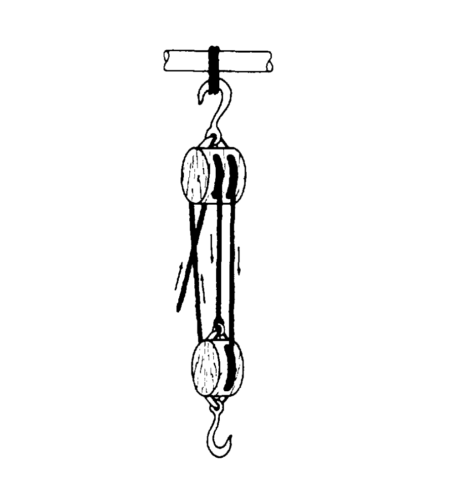
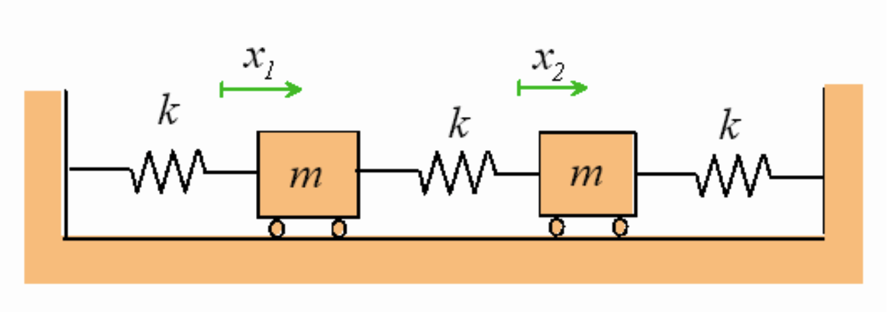
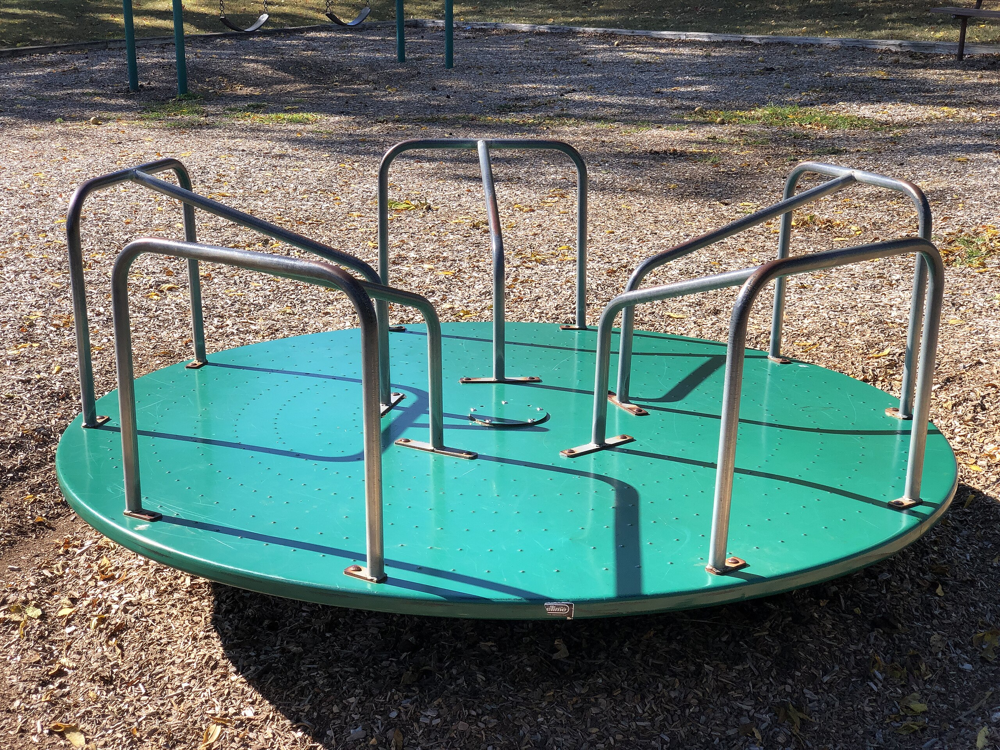
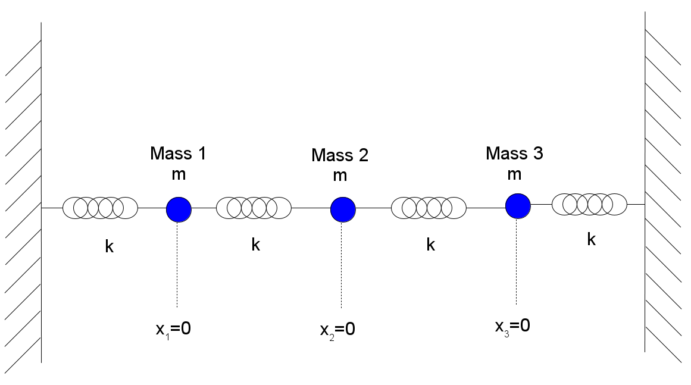

# Classical Mechanics &mdash; Daily Schedule Term 3

Course [home page](./)

See also: [Daily Schedule Term 2](./daily_schedule-term_2.html)

### Week 8 &mdash; Rotational/Internal Kinetic Energy &mdash; This Finishes Conservation Laws

* Thursday, Oct. 30 &mdash; Study Chapter C11 &mdash; The derivation culminating in Eq. C11.14 is the central result showing that we can divide up the total kinetic energy into C.o.M. K.E. and internal K.E. &mdash; The latter is very often, but not necessarily, rotational kinetic energy &mdash; It can also be pulsations or any other internal motion &mdash; Problem Set 11: 1. Re-do Problem 3 on [Exam 1](./exams/Exam1.nb.pdf) where a rod was modeled as 20 equal masses, *but this time compute the kinetic energy* 2. C11B.6; 3. C11B.8; 4. C11M.7 
  
### Week 9 &mdash; Newton's Laws &mdash; Forces From Motion (By Taking Derivatives of Position)

* Monday, Nov. 3 &mdash; Study Chapter N1 &mdash; Problem Set 12: 1. N1M.3; 2. N1M.4; 3. N1D.2 (you can use the result of N1D.1); 4. N1R.3 &mdash; I find that [my diagram for circular motion scaling](./resources/CircularMotionScaling.pdf) is both more exact and less complex than Moore's Fig. N1.6
* Thursday, Nov. 6 &mdash; Study Chapter N2 &mdash; Problem Set 13: 1. N2B.4; 2. N2B.8; 3. N2M.5; 4. N2M.8; 5. N2R.3

### Week 10 &mdash; Motion from Forces (By Doing Integrals of Acceleration) &mdash; Statics

* Monday, Nov. 10 &mdash; Review (if needed) Appendix NB on integral calculus, and then study Chapter N3 &mdash; Problem Set 14: 1. N3M.6; 2. N3D.4; 3. Use the same setup as N3D.4, except this time find *ax(t)*; 4. N3R.1; 5. N3R.2
* Presentations for Monday:
    * Grace: Newton had astronomical data for the average Earth-Moon distance and the period of the Moon's orbit around the Earth which is 27.3 days (not the usually-quoted 29.5 days) &mdash; Demonstrate, as Newton did, that there is consistency between the downward acceleration of objects near the Earth's surface, and the centripetal acceleration of the Moon as it proceeds around its approximately circular orbit (note, they are not identical, and also, you need equation N2.4a to demonstrate consistency) &mdash; Reference and explain [the famous thought experiment](./resources/PrincipiaDiagram.jpeg) that Newton included in *The Principia* &mdash; Grace found this [fun simulation of Newton's Cannon](https://physics.weber.edu/schroeder/software/NewtonsCannon.html)
	* Sam: Can you lead us through something like Example 3.5, but for several steps of the elliptical orbit of Comet C/2025 R2 (SWAN)? &mdash; Start of a worksheet is [here](./resources/CometSwan.pdf)
* Thursday, Nov. 13 &mdash; Study Chapter N4, which won't be on Monday, Nov 17th's exam &mdash; You can bring any review topics you want to discuss from Chapters C8-C11 and N1-N3 and/or I can be available for Q&A at multiple times on Saturday &mdash; Problem Set 15 on Chapter N4: 1. N4X.3 (try not to look at Moore's answer until you have one of your own); 2. N4B.5; 3. N4M.7 (give everything symbolic names before plugging in, *m* for the mass of the paint can, *c* for the length of the ladder leg, 2*a* for the separation of the rollers, and 2*b* for the length of the tie rod); 4. N4R.2

### Week 11 &mdash; Exam 2 &mdash; Linearly-Constrained Motion, Static Friction, and Kinetic Friction

* Monday, Nov. 17 &mdash; [Exam 2](./exams/Exam2.nb.pdf), covering Moore Chapters C8-C11 and N1-N3
* Wednesday, Nov. 19 &mdash; Chapter N5 &mdash; Problem Set 16: 1. N5T.10 (this is much easier to handle as a change in momentum problem rather than as a change in kinetic energy problem); 2. N5B.6 (be efficient and use that this is a proportional reasoning problem and you'll see that the units drop out); 3. N5B.7 (a lot like N5T.10 except this time he wants the distance traveled, not the change in speed); 4. N5M.10; 5. N5M.14 (instead of plugging in numbers, don't even bother with that, and just give good names to the variables, especially the ones you are solving for, which we can call *&mu;*s and *d*); 6. N5D.3

### Week 12 &mdash; Coupled Objects

* Monday, Nov. 24 &mdash; Study Chapter N6 &mdash; Coupled objects are really important to build intuition for &mdash; We draw a free-body diagram for each object in the system &mdash; We write down Newton's Laws for each object in the system &mdash; The equations for each object depend on the others (maybe not all the others, often just the nearest neighbors) &mdash; The coupled equations are often challenging to solve, but when solved, they often have surprising and lovely properties &mdash; Problem Set 17: 1. N6B.2; 2. N6B.6 Part (a) only; 3. N6M.4; 4. N6M.10; 5. N6R.3; 6. N6A.1
* Presentations for Monday:
  * Grace: Redo N6M.10 that goes with Figure N6.7, except instead of a single pulley, imagine using the block-and-tackle shown below. The hook holds the worker's chair. The rope that isn't connected to anything goes to the worker's hands. With this block-and-tackle system, now how much rope tension does the worker have to hang on to to keep in position?  
  
  * Sam: If the worker pulls the rope in by 1m meter, how much does the worker's chair rise in Problem N6M.10? How much does the worker rise in Grace's version of the problem (which has a block-and-tackle)? Make a work and potential energy argument that shows that the work done is in agreement with the potential energy increase?
  * Sasha: There are two types of solutions to the situation pictured below, and they are called &ldquo;normal modes.&rdquo; In the easier of the two modes to analyze, the two objects move *together.* Begin by drawing free-body diagrams for each cart. The gravity and normal forces hardly matter (because they must balance), but include them for completeness. The important forces are the forces exerted by the three springs on the two carts. Each cart has two springs acting on it. If the two springs move together (that is, if *x*1=*x*2), what is the whopping simplification in the equations?  
  
  * Brian: Do the other normal mode for Sasha's Problem.

### Week 13 &mdash; Non-Uniform Circular Motion &mdash; Non-Inertial Frames and Fictitious Forces

* Monday, Dec. 1 &mdash; Study Chapter N7 &mdash; You have already studied circular motion and know the fundamental result, but there are common and important additional examples of circular motion that are the focus of this chapter &mdash; As one of the many additional examples, Moore shows you how to deal with circular motion on a banked corner &mdash; Problem Set 18: 1. N7M.1; 2. N7M.4; 3. N7M.5; 4. N7M.9 (for N7M.9 you need to apply Eq. N7.18, including combining the two parts of N7.18 vectorially to find the length of the resulting acceleration vector)
  * Presentations for Monday:
    * Grace: [This is a slo-mo video](./resources/GraceOnSwing.mp4) of you on a swing &mdash; Use some equally-spaced frames in the video to measure some successive angles, and from the angles and an estimate of the length of the rope (two meters?), you can make an accurate motion diagram and thereby reasonably-accurately deduce the acceleration vectors at any point in the arc &mdash; For definiteness and for agreement with Sasha's presentation, strive for the part-way point to be the point where you were 60&deg; from vertical
    * Sam: Explain the proof/theory that culminates in Eq. N7.18
    * Sasha: Analyze the Grace-on-the-swing problem theoretically when she is part-way down at an angle 60&deg; from vertical, assuming the maximum point on her arc was 75&deg; from vertical, and the length of the swing is two meters, apply N7.18 to the analysis
    * Brian: Fictitious forces derivation (the theory for Section N8.5 of the coming chapter) for the Coriolis and centrifugal forces, and I will simplify by focusing only on a flat rotating coordinating system, such as a merry-go-round:  
	

	
* Thursday, Dec. 4 &mdash; Study Chapter N8, especially Sections N8.1, N8.2, and N8.3 which are quite important &mdash; Sections N8.4 and N8.5 may help build your intuition &mdash; Section N8.6 on fictitious forces is really pretty advanced, and except for one question about the Coriolis force on Problem Set 19, we will not consider fictitious forces any further
  * Problem Set 19 for Thursday: 1. Do these five two-minute problems, N8T.1, N8T.3, N8T.5, N8T.6, N8T.7; 2. N8M.4; 3. N8M.9; 4. N8R.3; 5. At a point not too far from the North Pole, where we can treat the Earth as a flat merry-go-round spinning around the North Pole, Santa is rushing north at speed, *vY*=50 m/s to go pick up another batch of presents (a) Taking east (around the merry-go-round) as the X direction and north (towards the center of the merry-go-round) as the Y direction, compute the Coriolis force on Santa and his sleigh (for this part, don't plug in any numbers and just assume Santa and his sleigh have mass *m*) (b) You should have found only an *X*-component in the Coriolis force in Part (a), and setting this equal to *m aX*, what is the *X*-component (eastward component) of Santa's acceleration as he rushes to the north? (still do not plug in numbers) (c) Assuming this eastward acceleration is constant and acts for a duration of 15 minutes, how much is Santa deflected to the east (now plug in numbers, using &omega; for the rotating Earth, and round your answer to the nearest number of kilometers)
  * Presentations for Thursday: Each person pick one additional problem (please coordinate with one another) from the modeling, derivations, or rich-context Problems from Chapter 8 to present. I will Do N8D.2 (a taste of how Einstein approached the bending of light).

### Week 14 &mdash; Projectile Motion &mdash; Oscillatory Motion

* Monday, Dec. 8 &mdash; Study Chapter N9 &mdash; Problem Set 20 for Monday: 1. N9B.8; 2. N9M.8; 3. N9D.2; 4. N9D.3; 5. N9R.2 (villagers!)
* Presentations for Monday:
  * Grace: Derive Equation N9.16 from N9.15 (that's a one-liner). Then change N9.15 to just be *FD=-C&rho;v* and get a new equation for the terminal velocity kind of like N9.16. The changed version of N9.15 is a familiar equation (you encountered it back in Problem N5D.3). What is its solution?
  * Sasha: Explain Equations N9.18, N9.19, and the curves in Figure N9.4.
  * Brian: I will show how to use Mathematica to get a Figure like N9.4
  * Sam: Apply the Newton app (which Sam found [here](https://physics.pomona.edu/sixideas/Newton/)) to N9M.12(a).
  

* Thursday, Dec. 11 &mdash; Study Chapter N10 &mdash; Problem Set 21 for Thursday: 1. N10B.4 (the MKS units for the spring constant are Newtons/meter or Joules/meter2, but in atomic physics a better unit of energy is the eV and a better unit of distance is the Angstrom, so convert your answer to eV/Angstrom2); 2. N10M.7 (let's assume the person on the pogo stick is a kid weighing 40kg); 3. N10A.1 (another advanced problem and this one gives you an idea of how oscillators show up as approximations to atomic potentials that do not look at all like oscillators until you make the approximations); 4. Relating the two most common expressions for oscillatory motion (see [handout](./resources/ThePlanFor2025-12-11.nb.pdf)); 5. A more sophisticated coupled objects oscillation problem (also on [handout](./resources/ThePlanFor2025-12-11.nb.pdf))
* Presentations for Thursday: Also see [handout](./resources/ThePlanFor2025-12-11.nb.pdf) &mdash; Unfortunately, we ran out of class time before I got to my presentation of the modes of [Three Coupled Harmonic Oscillators](./resources/ThreeCoupledHarmonicOscillators.nb.pdf)

### Week 15 &mdash; Exam 3 &mdash; Kepler's Laws

* Monday, Dec. 15 &mdash; [Exam 3](./exams/Exam3.nb.pdf), covering Moore Chapters N4 to N10 (including N8, but none of the fictitious force stuff in Sections N8.6 and N8.7)
* For Thursday, just prepare by doing the Kepler reading that Aaron found and that I distributed for a wonderful change of pace &mdash; The goal of the last class is to see how Kepler's Laws can be explained by Newton's Laws, which is one of Newton's definitive triumphs &mdash; Others in Newton's day had conjectures and incomplete arguments about a 1/*r*2 gravitational force law &mdash; What distinguished Newton is that he pushed his &ldquo;Law of Universal Gravitation&rdquo; through to an unambiguous conclusion that explained Brahe's, Kepler's and Galileo's work in a unifying sweep that set the gold standard for physics and all fields of science ever since
* The details below regard modern material that I will be drawing on:
  * Chapter N11 on Kepler's Laws &mdash; N11 is the last chapter of Unit N that Moore has marked as &ldquo;Core&rdquo; &mdash; We could also peek at N12 which is marked as &ldquo;Optional&rdquo; because it requires more calculus facility than people usually have at hand during their first semester of physics
  * We could perhaps also refer to [&ldquo;Feynman's Lost Lecture&rdquo;](https://dn710004.ca.archive.org/0/items/richard-feynman-pdf-library/Feynman%2C%20Richard%20%2837%20books%29/Feynman%27s%20Lost%20Lecture%20%5Bed.%20Goodstein%5D/Goodstein%2C%20D.%20%28ed.%29%20-%20Feynman%27s%20Lost%20Lecture%20%28Vintage%2C%201997%29.pdf)
